Generate and analyze simulated data for svaseq paper
========================================================


### Load packages

You will need the RSkittleBrewer, polyester, and ballgown packages for this vignette to run. Installation instructions are available here:

* https://github.com/alyssafrazee/RskittleBrewer
* https://github.com/alyssafrazee/polyester
* https://github.com/alyssafrazee/ballgown

You will also need R version 3.1.0 or greater and Bioconductor 3.0 or greater. The zebrafishRNASeq package might need to be installed from source. 


```r
library(zebrafishRNASeq)
library(RSkittleBrewer)
library(genefilter)
library(polyester)
library(RUVSeq)
library(edgeR)
library(sva)
```

```
## Loading required package: corpcor
## Loading required package: mgcv
## Loading required package: nlme
## 
## Attaching package: 'nlme'
## 
## The following object is masked from 'package:Biostrings':
## 
##     collapse
## 
## The following object is masked from 'package:IRanges':
## 
##     collapse
## 
## This is mgcv 1.7-29. For overview type 'help("mgcv-package")'.
```

```r
trop = RSkittleBrewer('tropical')
```


## Load and filter zebrafish data

Here we are going to load the zebrafish data to get an overall feeling
for the count data and relationship between mean and variance. We first filter
data according to the RUVSeq vignette: http://bioconductor.org/packages/devel/bioc/vignettes/RUVSeq/inst/doc/RUVSeq.R.


```r
data(zfGenes)
filter <- apply(zfGenes, 1, function(x) length(x[x>5])>=2)
counts <- zfGenes[filter,]
```

## Look at mean variance relationship


```r
plot(rowMeans(log(counts+1)),rowVars(log(counts+1)),pch=19,col=trop[1])
```

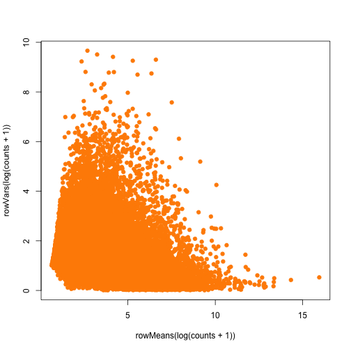

## Estimate zero inflated negative binomial parameters from the zebrafish data


```r
## Estimate the zero inflated negative binomial parameters
nsamples = dim(counts)[2]
counts0 = counts==0
nn0 = rowSums(!counts0)
nbmu = rowSums((!counts0)*counts)/nn0
s2 = rowSums((!counts0)*(counts - nbmu)^2)/(nn0-1)
nbsize = nbmu^2/(s2-nbmu + 0.0001)
nbsize = ifelse(nbsize > 0,nbsize,min(nbsize[nbsize > 0]))
nbp0 = (nsamples-nn0)/nsamples

## Fit a mean variance relationship model
lsize = log(nbsize)
lmu = log(nbmu)
modfit = smooth.spline(lsize ~ lmu)
plot(rowMeans(log(counts+1)),rowVars(log(counts+1)),pch=19,col=trop[1],main="zebrafish data w/fit")
lines(modfit,col=trop[2])
```

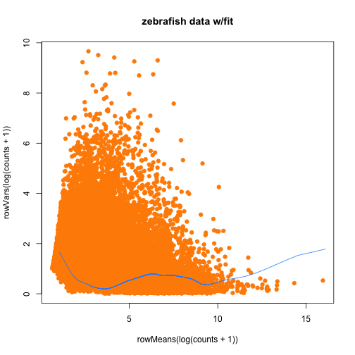 

## Generate an equal sized simulated data set and compare


```r
## Create some data from the model

gendata = function(n){
  ind = sample(1:length(lmu),size=1); lmu0 = lmu[ind];p00 = nbp0[ind]
  lsize0 = predict(modfit,lmu0)$y
  return(rnbinom(n,size=exp(lsize0),mu=exp(lmu0))*rbinom(n,prob=(1-p00),size=1))
}

dat0 = t(replicate(dim(counts)[1],gendata(dim(counts)[2])))
par(mfrow=c(1,2))
plot(rowMeans(log(dat0+1)),rowVars(log(dat0+1)),pch=19,col=trop[2],main="simulated data")
plot(rowMeans(log(counts+1)),rowVars(log(counts+1)),pch=19,col=trop[1],main="zebrafish data")
```

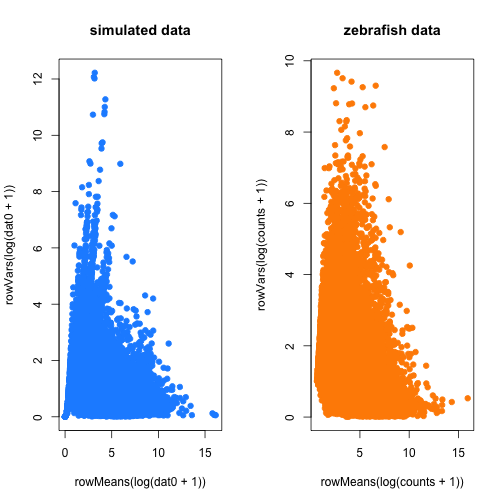 

## Make sure there is no differential expression using voom


```r
group = rep(c(0,1),each=3)
design = model.matrix(~group)
dge <- DGEList(counts=dat0)
dge <- calcNormFactors(dge)
v <- voom(dge,design,plot=TRUE)
```

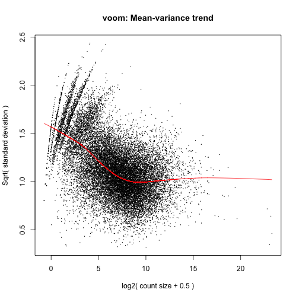 

```r
fit <- lmFit(v,design)
fit <- eBayes(fit)
hist(fit$p.value[,2],col=trop[3],main="No genes DE",breaks=100)
```

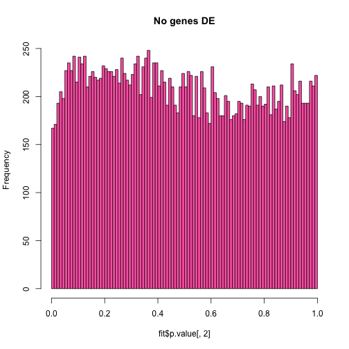 

## Generate a data set with some differential expression and test


```r
group = rep(c(-1,1),each=10)
coeffs = c(rnorm(200), rep(0,800))
dat0 = matrix(NA,nrow=1000,ncol=20)
for(i in 1:1000){
  ind = sample(1:length(lmu),size=1)
  lmu0 = lmu[ind] + coeffs[i] * group
  lsize0 = predict(modfit,lmu0)$y
  p00 = nbp0[ind]
  dat0[i,] = rnbinom(20,size=exp(lsize0),mu=exp(lmu0))*rbinom(20,prob=(1-p00),size=1)
}

design = model.matrix(~group)
dge <- DGEList(counts=dat0)
dge <- calcNormFactors(dge)
v <- voom(dge,design,plot=TRUE)
```

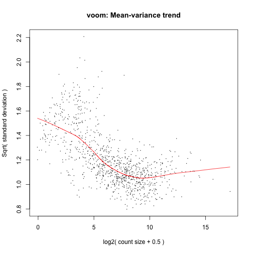 

```r
fit <- lmFit(v,design)
fit <- eBayes(fit)
hist(fit$p.value[,2],col=trop[3],main="200 genes DE",breaks=100)
```

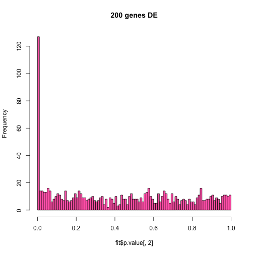 


## Generate a data set with a batch effect uncorrelated with group


```r
group = rep(c(-1,1),each=10)
batch = rep(c(-1,1),10)
coeffs = c(rnorm(200), rep(0,800))
bcoeffs = c(rep(0,300),rnorm(400,sd=2),rnorm(300))
dat0 = matrix(NA,nrow=1000,ncol=20)
for(i in 1:1000){
  ind = sample(1:length(lmu),size=1)
  lmu0 = lmu[ind]  + bcoeffs[i]*batch
  lsize0 = predict(modfit,lmu0)$y
  p00 = nbp0[ind]
  dat0[i,] = rnbinom(20,size=exp(lsize0),mu=exp(lmu0))*rbinom(20,prob=(1-p00),size=1)
}

design = model.matrix(~group)
dge <- DGEList(counts=dat0)
dge <- calcNormFactors(dge)
v <- voom(dge,design,plot=TRUE)
```

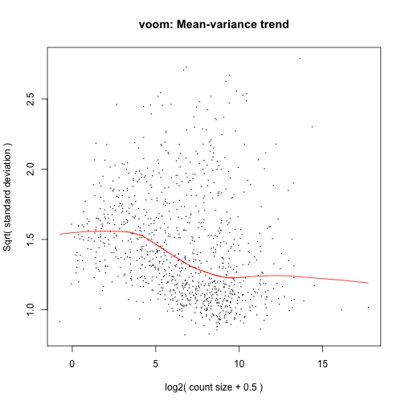 

```r
fit <- lmFit(v,design)
fit <- eBayes(fit)
hist(fit$p.value[,2],col=trop[3],main="400 genes batch affected",breaks=100)
```

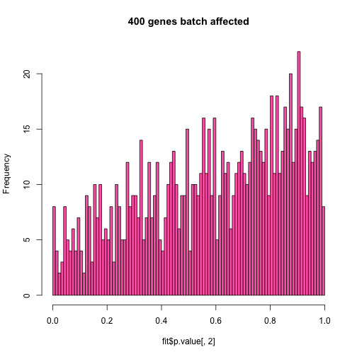 

## Generate a data set with a batch and group effects and estimate batch three ways


```r
set.seed(243)
group = rep(c(-1,1),each=10)
tmp = rbinom(20,prob=0.8,size=1)
batch = group*tmp + (1-tmp)*(-group)
#batch = sample(c(-1,1),size=20,replace=TRUE)
coeffs = c(rnorm(400,sd=2), rep(0,600))
bcoeffs = c(rep(0,300),rnorm(400,sd=2),rnorm(300))
dat0 = matrix(NA,nrow=1000,ncol=20)
for(i in 1:1000){
  ind = sample(1:length(lmu),size=1)
  lmu0 = lmu[ind]  + bcoeffs[i]*batch + coeffs[i]*group
  lsize0 = predict(modfit,lmu0)$y
  p00 = nbp0[ind]
  dat0[i,] = rnbinom(20,size=exp(lsize0),mu=exp(lmu0))*rbinom(20,prob=(1-p00),size=1)
}

## Estimate batch with svaseq (unsupervised)
mod = model.matrix(~group)
mod0 = cbind(mod[,1])
batch_unsup_sva = svaseq(dat0,mod,mod0)$sv
```

```
## Number of significant surrogate variables is:  1 
## Iteration (out of 5 ):1  2  3  4  5
```

```r
batch_sup_sva = svaseq(dat0,mod,mod0,controls=(bcoeffs!=0))$sv
```

```
## sva warning: controls provided so supervised sva is being performed.
## Number of significant surrogate variables is:  1
```

```r
## Estimate batch with pca
ldat0 = log(dat0 + 1)
batch_pca = svd(ldat0 - rowMeans(ldat0))$v[,2]

## Estimate batch with ruv (controls known)
batch_ruv_cp <- RUVg(dat0, cIdx= (bcoeffs!=0), k=1)$W

## Estimate batch with ruv (residuals)
x <- as.factor(group)
design <- model.matrix(~x)
y <- DGEList(counts=dat0, group=x)
y <- calcNormFactors(y, method="upperquartile")
y <- estimateGLMCommonDisp(y, design)
y <- estimateGLMTagwiseDisp(y, design)
fit <- glmFit(y, design)
res <- residuals(fit, type="deviance")
seqUQ <- betweenLaneNormalization(dat0, which="upper")
controls = rep(TRUE,1000)
batch_ruv_res = RUVr(seqUQ,controls,k=1,res)$W

## Estimate batch with ruv empirical controls

y <- DGEList(counts=dat0, group=x)
y <- calcNormFactors(y, method="upperquartile")
y <- estimateGLMCommonDisp(y, design)
y <- estimateGLMTagwiseDisp(y, design)

fit <- glmFit(y, design)
lrt <- glmLRT(fit, coef=2)

controls =rank(lrt$table$LR) <= 400
batch_ruv_emp <- RUVg(dat0, controls, k=1)$W


## Plot the results
plot(batch,col=trop[1],pch=19,main="batch")
```

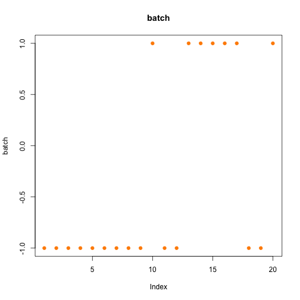 

```r
plot(batch_unsup_sva,pch=19,col=trop[2],main="unsupervised sva")
```

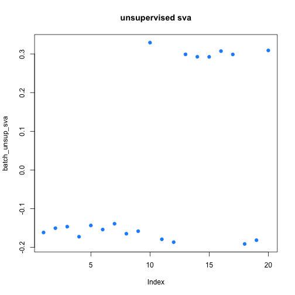 

```r
plot(batch_sup_sva,pch=19,col=trop[2],main="supervised sva")
```

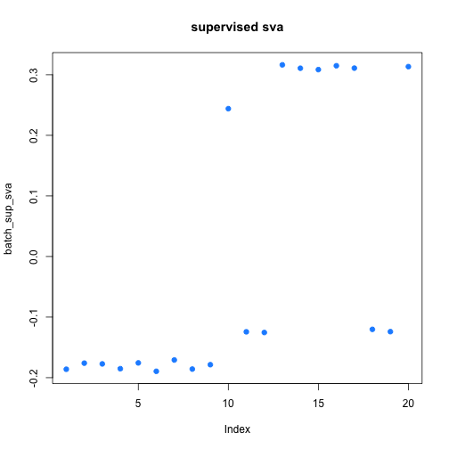 

```r
plot(batch_pca,pch=19,col=trop[3],main="pca")
```

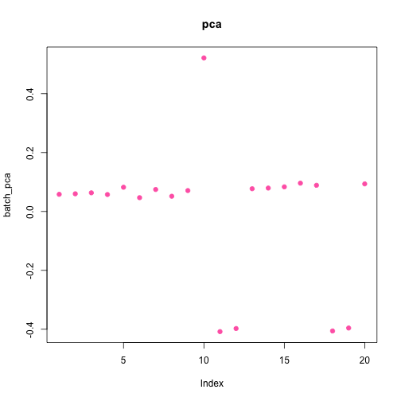 

```r
plot(batch_ruv_cp,pch=19,col=trop[4],main="control probes ruv")
```

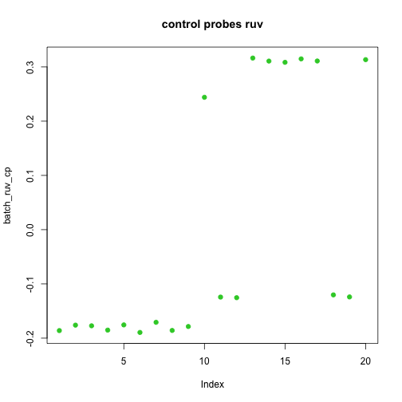 

```r
plot(batch_ruv_res,pch=19,col=trop[4],main="residual ruv")
```

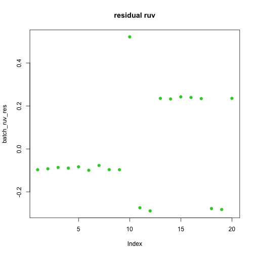 

```r
plot(batch_ruv_emp,pch=19,col=trop[4],main="empirical controls ruv")
```

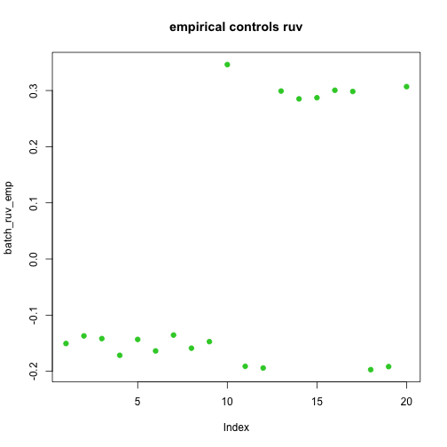 

```r
## Correlations

cor(batch,batch_unsup_sva)
```

```
## [1] 0.9977
```

```r
cor(batch,batch_sup_sva)
```

```
## [1] 0.9933
```

```r
cor(batch,batch_pca)
```

```
## [1] 0.4881
```

```r
cor(batch,batch_ruv_cp)
```

```
##         W_1
## [1,] 0.9933
```

```r
cor(batch,batch_ruv_res)
```

```
##         W_1
## [1,] 0.9109
```

```r
cor(batch,batch_ruv_emp)
```

```
##         W_1
## [1,] 0.9955
```

```r
## supervised sva and ruv cp are the same
cor(batch_ruv_cp,batch_sup_sva)
```

```
##     [,1]
## W_1    1
```
